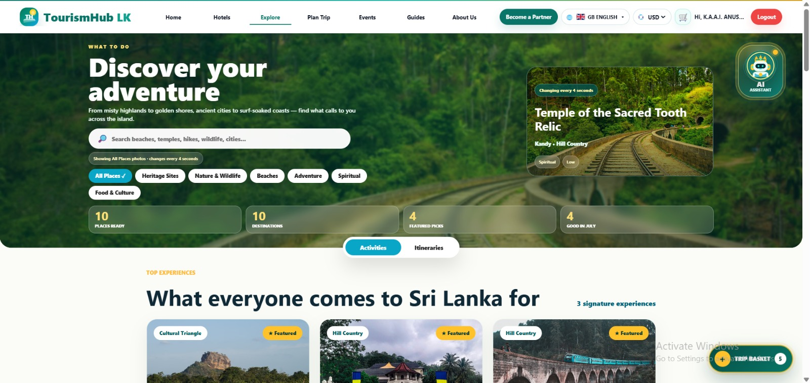
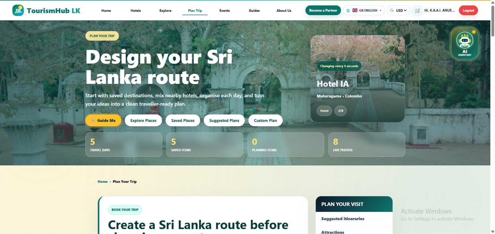
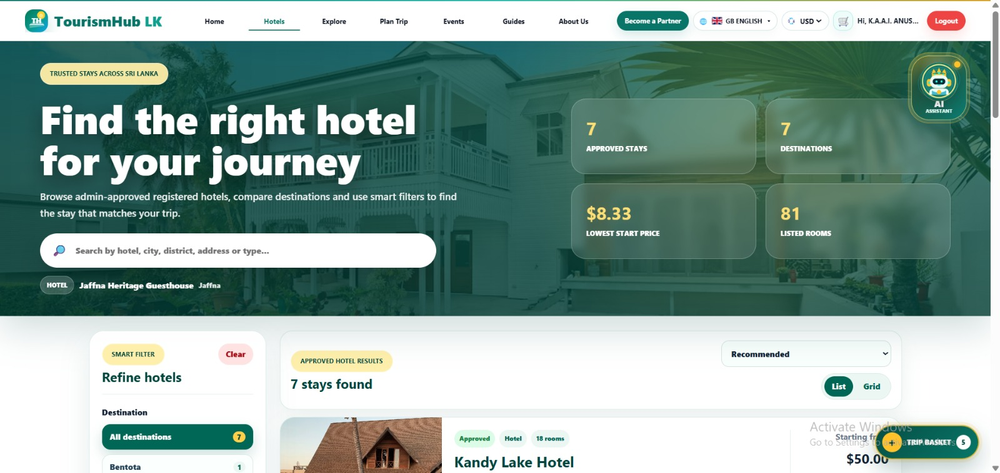
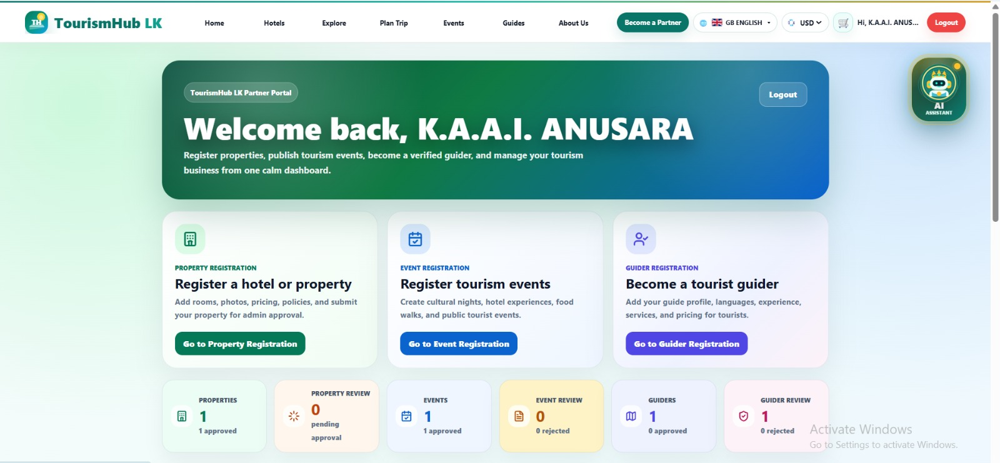
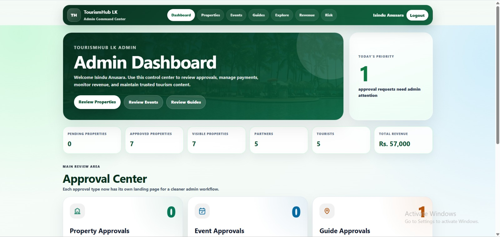

# TripLanka

## Smart Hotel and Tourism Management System


**TripLanka** is a smart hotel and tourism management platform designed for the Sri Lankan tourism industry. It connects tourists, hotel and tourism partners, tourist guides, event providers, reception staff, and administrators through one integrated system.

Tourists can discover destinations, search verified hotels, create bookings, build day-by-day travel plans, view real road routes, discover events, find tourist guides, manage reservations, change language and currency preferences, and use the AI tourism assistant.

Partners can register and manage properties, rooms, tourist events, guide services, booking requests, photos, policies, and selected payment-related functions. Administrators can approve and manage platform content and services. Reception staff use a separate front-desk application for the assigned hotel.

---

## Main Tourist Journey

```text
Home
  ↓
Explore destinations
  ↓
View place details
  ↓
Save destinations / hotels / events / guides to Trip Basket
  ↓
Build a day-by-day Trip Plan
  ↓
Analyze the real road route on the map
  ↓
Manage bookings and travel activities
```

---

## Main Modules

### Tourist and Public Platform

- Home page with connected access to the main tourist services
- Tourist registration and login
- Hotel search, filters, sorting, details, rooms, availability, and booking
- Booking confirmation, My Bookings, cancellation, and invoice PDF
- Explore Sri Lanka destination search and filters
- Destination detail pages and saved destinations
- Trip Basket for destinations, hotels, events, and tourist guides
- Day-by-day Trip Planner
- Fastest and shortest road-route analysis
- Leaflet map with OpenStreetMap tiles
- OpenRouteService-based road routing, distance, and duration
- Trip-plan saving/editing and PDF export functions
- Tourist event listings and event detail pages
- Event reporting and report-status tracking
- Tourist-guide listings and detailed guide profiles
- Guide booking-request workflow and reviews
- Language and currency preferences
- AI tourism assistant
- Responsive public navigation and layouts

### Hotel and Tourism Partner Portal

- Partner registration and login
- Property registration and management
- Property-plan selection
- Room, price, availability, photo, and policy management
- Customer booking management
- Tourist event registration and management
- Tourist-guide registration and management
- Guide-registration and selected promotion/payment workflows
- Partner dashboard

### Administrator Portal

- Administrator authentication
- Dashboard and platform statistics
- User management
- Property review, approval, rejection, and verification
- Explore category and destination management
- Destination-image management
- Tourist-event approval and moderation
- Tourist-guide approval
- Payment and revenue monitoring
- Event-report investigation and resolution

### Reception Portal

Reception is a separate frontend application.

- Reception login using the hotel partner email and property management password
- Property-scoped reception authentication
- Front-desk dashboard
- Room availability management
- Walk-in guest registration and booking creation
- Online booking approval/rejection
- Guest check-in and check-out
- Booking cancellation and payment-status updates
- Guest and booking search

Local URLs:

```text
Main/public site:    http://localhost:5173
Admin site:          http://localhost:5174
Reception site:      http://localhost:5175
Backend API:         http://localhost:5000
```

---

## Technology Stack

### Frontend

- React
- React Router
- Vite
- JavaScript / JSX
- HTML / CSS
- Leaflet
- jsPDF

### Backend

- Node.js
- Express.js
- REST APIs
- JSON Web Tokens (JWT)
- CORS
- dotenv
- Multer
- mysql2
- Google GenAI integration

### Database

- MySQL Community Edition
- Relational tables, foreign keys, indexes, and JSON fields where suitable

### Maps and Routing

- **Leaflet** — interactive map display and route visualization
- **OpenStreetMap** — map tiles
- **OpenRouteService** — real road routing, distance, and estimated duration

---

## System Architecture

TripLanka follows a three-tier architecture:

```text
React Frontend Applications
        ↓
REST API Requests
        ↓
Node.js + Express Backend
        ↓
MySQL Database
```

The backend also communicates with external services such as OpenRouteService and the configured AI provider.

---

## Project Structure

```text
e23-co2060-Hotel-Management-System/
│
├── admin-client/        # Administrator frontend - port 5174
├── reception-client/    # Reception frontend - port 5175
├── client/              # Tourist/public/partner frontend - port 5173
├── database/
│   ├── schema.sql       # Final database structure
│   └── seed.sql         # Final initial/reference/demo data
├── docs/
├── server/              # Node.js and Express backend - port 5000
├── .gitignore
└── README.md
```

---

## Installation and Setup

### 1. Clone the repository

```bash
git clone https://github.com/cepdnaclk/e23-co2060-Hotel-Management-System.git
cd e23-co2060-Hotel-Management-System
```

### 2. Install dependencies

Main client:

```bash
cd client
npm install
```

Admin client:

```bash
cd ../admin-client
npm install
```

Reception client:

```bash
cd ../reception-client
npm install
```

Backend:

```bash
cd ../server
npm install
```

---

## Database Setup

The final repository uses **only two SQL files for a fresh database setup**:

```text
database/schema.sql
database/seed.sql
```

Run them in this exact order:

```text
1. schema.sql
2. seed.sql
```

`schema.sql` creates the complete final database structure, including hotel management, Explore, Home, Trip Planner, routing cache/access points, events, event reports, tourist guides, guide bookings, guide payments, and reviews.

`seed.sql` contains the final reference/demo data, local image paths, Explore destinations, Home-page data, Trip Planner configuration, routing configuration, events, guides, properties, rooms, and related records.

> **Important:** `schema.sql` drops and recreates the `tourismhub_lk` database. Use it for a fresh setup only. Do not run it against a database that contains data you need to keep.

After setup:

```sql
USE tourismhub_lk;
SHOW TABLES;
```

---

## Environment Variables

Create `server/.env` and keep real secret values private.

Example:

```env
DB_HOST=localhost
DB_PORT=3306
DB_USER=root
DB_PASSWORD=YOUR_MYSQL_PASSWORD
DB_NAME=tourismhub_lk

PORT=5000
NODE_ENV=development

JWT_SECRET=YOUR_SECURE_JWT_SECRET
ADMIN_REGISTRATION_SECRET=YOUR_SECURE_ADMIN_SECRET

CLIENT_URL=http://localhost:5173
ADMIN_CLIENT_URL=http://localhost:5174
RECEPTION_CLIENT_URL=http://localhost:5175

ROUTING_API_KEY=YOUR_OPENROUTESERVICE_KEY

GEMINI_API_KEY=YOUR_GEMINI_API_KEY
GEMINI_MODEL=gemini-2.5-flash
GEMINI_TRANSLATION_MODEL=gemini-2.5-flash
TRANSLATION_PROVIDER=gemini
```

Optional routing retry/snap values are supported by the backend, but the normal Trip Planner routing configuration is stored in the database.

Never commit:

- `.env`
- Database passwords
- JWT/admin secrets
- OpenRouteService keys
- Gemini/translation API keys
- Access tokens

---

## Running the System

Open separate terminals.

Backend:

```bash
cd server
npm run dev
```

Main/public client:

```bash
cd client
npm run dev
```

Admin client:

```bash
cd admin-client
npm run dev
```

Reception client:

```bash
cd reception-client
npm run dev
```

---

## Testing

Backend test suite:

```bash
cd server
npm test
```

Important focused tests include:

```bash
npm run test:auth
npm run test:properties
npm run test:bookings
npm run test:guides
npm run test:events
npm run test:reception
npm run test:trip-planner
npm run test:images
```

Production client build:

```bash
cd client
npm run build
```

The admin and reception clients can also be verified with their own Vite build commands.

---

## Current Project Status

| Module | Status |
|---|---|
| Tourist registration and login | Completed |
| Home page | Completed |
| Hotel search, filters, details, rooms and booking | Completed |
| My Bookings, cancellation and invoice PDF | Completed |
| Explore Sri Lanka | Completed |
| Place details and saved places | Completed |
| Trip Basket | Completed |
| Trip Planner and map routing | Completed |
| Trip-plan PDF/export functions | Implemented |
| Tourist events | Completed for current project scope |
| Event details and event reports | Completed |
| Tourist-guide listing and profiles | Completed |
| Guide booking requests and reviews | Implemented |
| Language and currency preferences | Completed |
| AI tourism assistant | Implemented |
| Partner portal | Completed for current project scope |
| Admin portal and approvals | Completed for current project scope |
| Reception portal | Completed for current project scope |
| Responsive UI | Implemented across the main project interfaces |
| Production cloud deployment | Not part of the local final setup |

---

## Key Integration Flow

The main tourist modules are intentionally connected:

```text
Explore ─────┐
Hotels ──────┤
Events ──────┼──> Trip Basket ───> Trip Planner
Guides ──────┘
```

The Trip Planner uses database-driven configuration and destination coordinates. The backend performs routing through OpenRouteService, while Leaflet renders the map, destination markers, and returned road geometry.

---

## Screenshots

### Landing Page


### Explore Sri Lanka



### Trip Planner



### Hotel Details



### Partner Dashboard



### Admin Dashboard



---

## Team Members

| Name | Index Number | Primary Contribution Areas |
|---|---|---|
| Anushka W.L.K. | E/23/016 | Project coordination, full-stack development, UI/UX, Explore, Trip Planner, integration, testing, and documentation |
| Anusara K.A.A.I. | E/23/015 | Full-stack development, database design, hotel management, room and booking functions, backend APIs, and integration |
| Lakshani R.M.K.S. | E/23/196 | Full-stack development, partner interfaces, events, admin functions, testing, debugging, and documentation |

Although each member had primary responsibilities, all members contributed to frontend development, backend development, database work, integration, testing, debugging, and documentation.

---

## Current Limitations

- Online payment flows are demonstration/academic implementations rather than a production payment gateway.
- The final system is primarily configured and tested for local development.
- Production security hardening, cloud deployment, large-scale load testing, and complete external-service monitoring would be required before real commercial deployment.

---

## Future Improvements

- Production payment-gateway integration
- Cloud deployment and CI/CD
- Email/SMS notification services
- Broader review/reporting features across all service types
- Advanced recommendations and analytics
- Expanded multilingual content
- Production-scale security, load, and user-acceptance testing

---

## Academic Information

```text
CO2060 – Software Systems Design Project
Department of Computer Engineering
Faculty of Engineering
University of Peradeniya
Group: E23_GR40
```

---

## Repository Branches

- `dev` — integration/development branch
- `main` — final consolidated branch used for the completed project version

Before merging `dev` into `main`, run the database fresh-setup check, backend tests, and frontend builds.

---

## License

This project was developed for academic and educational purposes.
