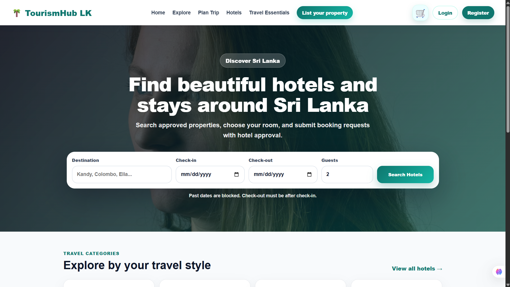
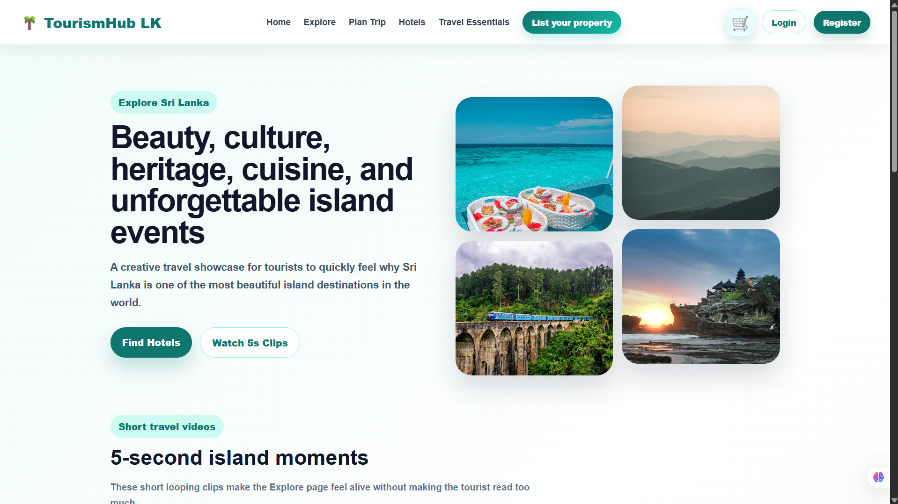
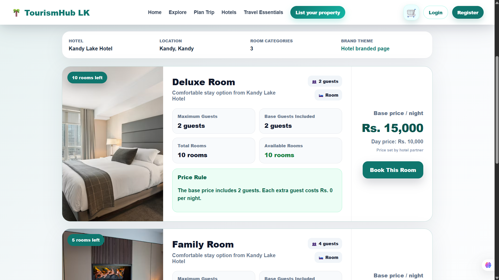
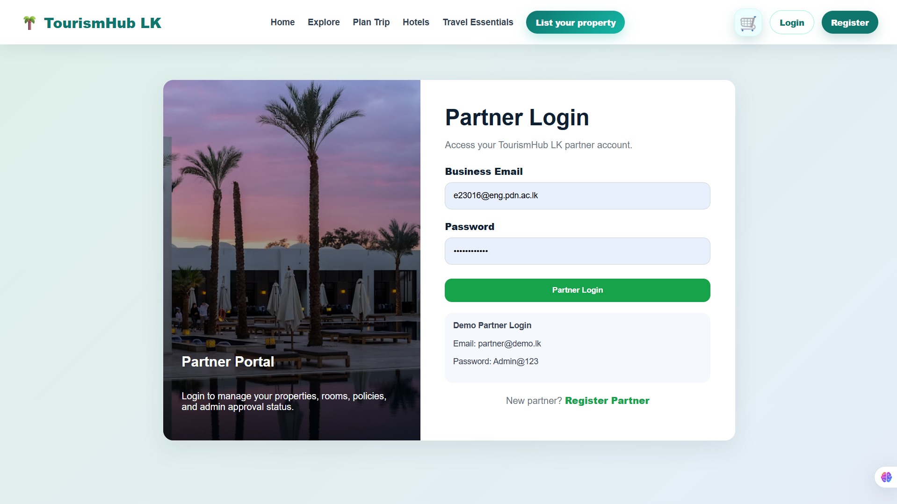
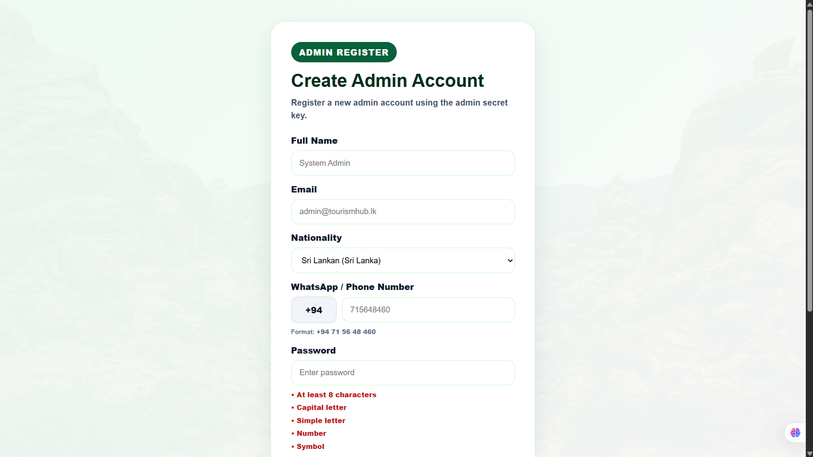

# TourismHub LK

## Smart Hotel and Tourism Management System


**TourismHub LK** is a mobile-responsive smart hotel and tourism management platform developed for the Sri Lankan tourism industry.

The platform connects tourists, hotel and tourism partners, tourist guides, event providers, reception staff, and administrators through one integrated system.

Tourists can explore Sri Lankan destinations, create travel plans, search for hotels, check rooms, make bookings, view events, find tourist guides, manage reservations, select languages and currencies, and use an AI tourism assistant.

Hotel and tourism partners can register properties and services, manage rooms, prices, bookings, events, guides, photos, policies, and selected payment-related functions.

Administrators can verify properties, manage users, approve events and guides, maintain Explore content, monitor payments, and control platform activities.

---

## Project Overview

Tourism information, hotel booking, trip planning, tourist events, and guide services are often available through separate platforms. TourismHub LK brings these services together and provides a connected workflow for tourists and tourism businesses.

A typical tourist journey through the platform is:

```text
Explore Sri Lanka
        ↓
Save destinations
        ↓
Create a trip plan
        ↓
Search for hotels
        ↓
Check rooms and availability
        ↓
Create a booking
        ↓
Manage the booking in My Bookings
```

The system also provides separate operational portals for hotel partners, administrators, and reception staff.

---

## Main Modules

### Tourist Platform

Tourists can:

- Create an account and log in securely
- Browse the mobile-responsive landing page
- Search for hotels by name or location
- Filter and sort hotel results
- View hotel information, photos, facilities, rooms, prices, and policies
- View room details and check availability
- Create hotel bookings
- Use a demonstration payment workflow
- Receive a booking confirmation and reference number
- View bookings through the **My Bookings** page
- Cancel supported bookings
- Download booking invoices as PDF documents
- Explore Sri Lankan tourist destinations
- Filter destinations by category
- Open detailed destination pages
- Save destinations for trip planning
- Create custom or suggested trip plans
- Organize destinations using a day-by-day planner
- Browse tourist events and event details
- Browse tourist guides and guide profiles
- Change supported language preferences
- Change supported currency preferences
- Ask tourism-related questions using the AI assistant

### Hotel and Tourism Partner Portal

Partners can:

- Register and log in to the partner portal
- List and register properties
- Select available property plans
- Manage property details
- Add and update rooms
- Manage room availability
- Manage room pricing
- Upload property and room photographs
- Manage property policies
- View and manage customer bookings
- Register and manage tourist events
- Register tourist-guide services
- Complete demonstration guide-registration payments
- Use selected guide-promotion and property-payment functions
- View business information through the partner dashboard

### Administrator Portal

Administrators can:

- Log in through the admin portal
- View platform statistics through the admin dashboard
- View and manage users
- Review registered properties
- Approve or reject properties
- Mark approved properties as verified
- Manage Explore Sri Lanka categories
- Create, update, and remove destinations
- Upload and manage destination images
- Approve or reject tourist events
- Approve or reject tourist guides
- Monitor property-related payments
- Monitor guide-related payments
- View payment and revenue information
- Manage selected complaints and reports

### Reception Module

Reception staff can:

- Log in through the reception portal
- Access information for the assigned property
- View property bookings
- Create or manage selected bookings
- Update room availability
- Support the connection between online bookings and daily hotel operations

---

## Additional Features

### Explore Sri Lanka

The Explore module provides destination information using categories such as:

- Heritage sites
- Nature and wildlife
- Beaches
- Adventure
- Spiritual destinations
- Food and culture

Each place may include photographs, descriptions, location details, highlights, estimated duration, and related travel information.

### Trip Planner

The Trip Planner allows tourists to:

- Enter a trip name
- Select a start date
- Choose the number of travel days
- Select travel style, budget, and pace
- View saved destinations
- Use suggested plans
- Create a custom route
- Organize destinations by day
- Add travel notes and hotel requirements
- Export selected trip information as a PDF

Some advanced planner-saving and PDF functions are still being refined.

### Tourist Events

The event module supports:

- Public event listings
- Event detail pages
- Partner event registration and management
- Administrator event approval and rejection

### Tourist Guides

The tourist-guide module supports:

- Public guide listings
- Detailed guide profiles
- Guide registration
- Guide approval and rejection
- Guide registration payments
- Selected guide-promotion functions
- Currency-aware guide-price presentation

### AI Tourism Assistant

The AI assistant helps users:

- Ask questions about Sri Lankan destinations
- Receive travel-related guidance
- Understand website functions
- Access fallback tourism information when an external AI response is unavailable

### Language and Currency Preferences

The system provides shared preference controls for supported languages and currencies. These settings are applied across relevant public pages and pricing information.

---

## Current Project Status

| Module | Current Status |
|---|---|
| Tourist registration and login | Completed |
| Landing page | Completed |
| Hotel search and filters | Completed |
| Hotel and room details | Completed |
| Hotel booking | Completed |
| Booking confirmation | Completed |
| My Bookings | Completed |
| Booking cancellation | Completed |
| Invoice PDF | Completed |
| Explore Sri Lanka | Completed |
| Place details and saved places | Completed |
| Trip Planner | In progress |
| Trip-plan PDF | In progress |
| Tourist events | In progress |
| Event details | Completed |
| Tourist-guide listing | In progress |
| Guide profiles | Completed |
| Language selection | Completed |
| Currency selection | Completed |
| AI tourism assistant | Completed |
| Partner registration and login | Completed |
| Property and room management | Completed |
| Partner booking management | Completed |
| Event and guide registration | Completed |
| Admin dashboard and approvals | Completed |
| Payment and revenue monitoring | Completed |
| Complaint and report handling | In progress |
| Reception login | Completed |
| Reception dashboard and bookings | In progress |
| Mobile responsiveness | In progress |
| Production deployment | Pending |

---

## Technology Stack

### Frontend

- React
- React Router
- Vite
- JavaScript
- HTML
- CSS

### Backend

- Node.js
- Express.js
- REST APIs
- JSON Web Tokens
- CORS
- dotenv
- Multer/file-upload handling
- mysql2

### Database

- MySQL Community Edition
- MySQL Workbench
- Relational tables, foreign keys, and indexes

### Development and Testing Tools

- Visual Studio Code
- Git
- GitHub
- Postman
- npm
- Browser Developer Tools
- Figma
- Nodemon
- ESLint
- Prettier

---

## System Architecture

TourismHub LK follows a three-tier architecture.

```text
React Frontend Applications
        ↓
REST API Requests
        ↓
Node.js and Express Backend
        ↓
MySQL Relational Database
```

The project contains separate interfaces for:

```text
Tourist and public users
Hotel and tourism partners
Administrators
Reception staff
```

Authentication and role-based access are handled through the backend.

---

## Project Structure

```text
e23-co2060-Hotel-Management-System/
│
├── admin-client/        # Administrator frontend
├── client/              # Tourist, partner, and public frontend
├── database/            # Database schema and seed files
├── docs/                # Documentation, images, and screenshots
├── server/              # Node.js and Express backend
├── .gitignore
└── README.md
```

---

## Installation and Setup

### 1. Clone the repository

```bash
git clone https://github.com/cepdnaclk/e23-co2060-Hotel-Management-System.git
```

### 2. Open the project directory

```bash
cd e23-co2060-Hotel-Management-System
```

### 3. Install and run the main client

```bash
cd client
npm install
npm run dev
```

### 4. Install and run the admin client

Open a new terminal from the project root:

```bash
cd admin-client
npm install
npm run dev
```

### 5. Install and run the backend

Open another terminal from the project root:

```bash
cd server
npm install
npm run dev
```

When the backend does not contain a development script, use:

```bash
npm start
```

---

## Database Setup

The database scripts are available inside the `database` directory.

Create the database:

```sql
CREATE DATABASE tourismhub_lk;
USE tourismhub_lk;
```

Run the SQL files in the order used by the current project version.

Example:

```text
1. Main schema file
2. Seed-data file
3. Additional module SQL files, when included
```

Check the created tables:

```sql
SHOW TABLES;
```

Major database areas include:

- Users and authentication
- Properties and rooms
- Property and room photos
- Property policies
- Hotel bookings
- Property plans
- Payment methods and transactions
- Explore categories and destinations
- Explore images and itineraries
- Tourist events
- Tourist guides
- Guide-payment transactions

---

## Environment Variables

Create a `.env` file inside the `server` directory.

Example:

```env
DB_HOST=localhost
DB_USER=root
DB_PASSWORD=your_mysql_password
DB_NAME=tourismhub_lk
PORT=5000

JWT_SECRET=replace_with_a_secure_secret
ADMIN_REGISTRATION_SECRET=replace_with_a_secure_admin_secret
```

Do not upload the `.env` file to GitHub.

The `.gitignore` file should include:

```text
.env
node_modules
dist
```

Never commit:

- Database passwords
- API keys
- JWT secrets
- Admin secrets
- Access tokens

---

## Important Backend API Areas

The current backend contains APIs for:

- Authentication
- Public property and hotel data
- Property and room management
- Bookings
- Explore Sri Lanka
- Tourist events
- Partner events
- Admin event management
- Public tourist guides
- Partner guide management
- Admin guide management
- Translation
- AI tourism assistant
- Reception operations
- Admin management
- Payment and revenue functions

---

## Screenshots

Store the latest screenshots inside:

```text
docs/screenshots/
```

Recommended screenshot names:

```text
home-page.png
explore-page.png
place-details-page.png
trip-planner-page.png
hotels-page.png
hotel-details-page.png
booking-page.png
my-bookings-page.png
events-page.png
guides-page.png
partner-dashboard.png
admin-dashboard.png
reception-dashboard.png
```

Example:

```markdown
### Landing Page



### Explore Sri Lanka



### Trip Planner


### Hotel Details



### Partner Dashboard



### Admin Dashboard


```

The screenshot filenames must exactly match the files inside the folder.

---

## Team Members

| Name | Index Number | Primary Contribution Areas |
|---|---|---|
| Anushka W.L.K. | E/23/016 | Project coordination, full-stack development, UI/UX, Explore, Trip Planner, integration, testing, and documentation |
| Anusara K.A.A.I. | E/23/015 | Full-stack development, database design, hotel management, room and booking functions, backend APIs, and integration |
| Lakshani R.M.K.S. | E/23/196 | Full-stack development, partner interfaces, events, admin functions, testing, debugging, and documentation |

Although each member had primary responsibilities, all members contributed to frontend development, backend development, database work, integration, testing, debugging, and documentation.

---

## Current Limitations

The current academic version has the following limitations:

- It uses demonstration or mock online payments
- A real bank or payment-gateway integration is not included
- Some advanced Trip Planner saving and PDF functions are still being refined
- Final double-booking prevention requires further validation
- Guide-listing and guide-promotion functions require further improvements
- Complaint and report handling is partially implemented
- Reception booking management is partially implemented
- Some complex pages require further mobile-responsive testing
- The current system is primarily tested in a local development environment

---

## Future Improvements

- Complete double-booking prevention
- Improve Trip Planner saving and PDF generation
- Complete guide booking and promotion workflows
- Complete event booking and complaint handling
- Complete reception dashboard and booking management
- Integrate a secure real payment gateway
- Improve mobile responsiveness across all modules
- Add email and notification services
- Add a complete review and rating system
- Improve hotel and itinerary recommendations
- Add advanced analytics and reporting
- Improve multilingual content coverage
- Complete cloud deployment
- Perform full user-acceptance and security testing

---

## Academic Information

This project was developed as part of:

```text
CO2060 – Software Systems Design Project
Department of Computer Engineering
Faculty of Engineering
University of Peradeniya
```

**Group:** E23_GR40

---

## Repository Version

The `main` branch contains the final consolidated project version used for evaluation.

A backup of the previous main branch was maintained before replacing it with the completed development version.

---

## License

This project was developed for academic and educational purposes.
