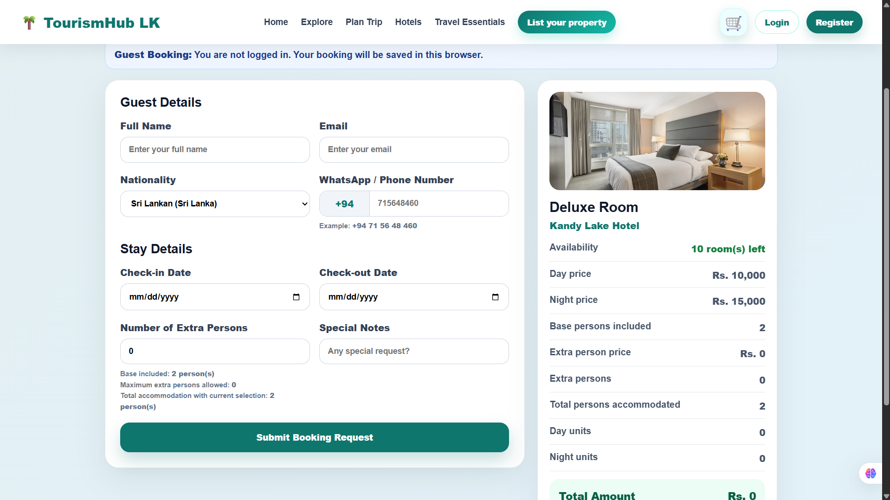
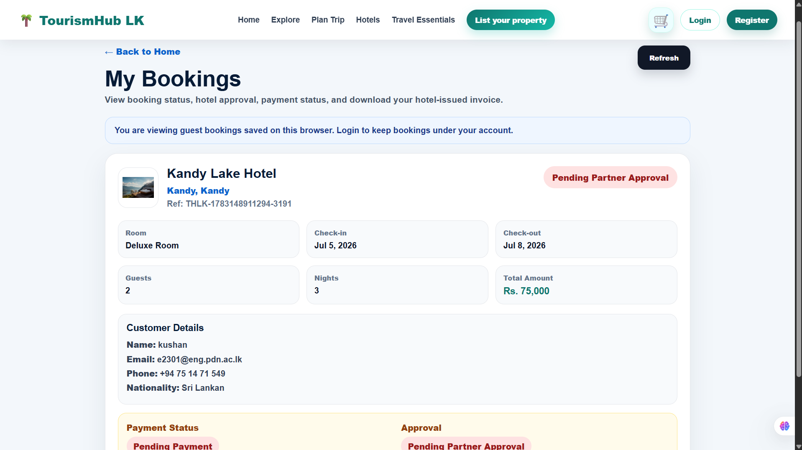

# TourismHub LK

## Smart Hotel and Tourism Management System

TourismHub LK is a smart hotel and tourism management system developed as a semester project. The system helps tourists explore Sri Lanka, plan trips, book hotels and select tourism services.

It also provides small and medium-scale hotels with a digital platform to manage hotel operations such as bookings, rooms, pricing, dining, events and table reservations.
   
## 📌Project Overview


> **TourismHub LK** is designed to support both tourists and hotel businesses in Sri Lanka.

Tourists can search hotels, view hotel details, check room availability, create bookings, choose payment options, manage reservations, explore tourist places and plan trips.

Hotel partners can use the system as hotel management software to manage bookings, rooms, pricing, dining services, table reservations and hotel events.

Admin users can monitor platform activity, review hotel listings, approve or reject hotels and manage complaints or reports.
## ✨Main Features

- Tourist hotel search and booking system
- Sri Lanka tourism exploration
- Trip planning support for tourists
- Room availability checking
- Hotel booking management
- Payment option selection
- Tourist guide selection support
- Partner dashboard for hotel owners
- Room and pricing management
- Dining and restaurant management
- Table reservation management
- Hotel event management
- Admin dashboard for platform monitoring
- Hotel approval and rejection workflow
- Complaint and report management
- Mobile-responsive user interface
## 👥Main User Roles


### Tourist

Tourists can:

- View hotels
- View hotel details
- Explore Sri Lankan tourist places
- Plan trips
- Check room availability
- Submit booking details
- Choose payment method
- Select tourist guides
- Receive booking confirmation
- View bookings in the My Bookings page

### Partner

Hotel partners can:

- View partner dashboard statistics
- View hotel bookings
- Manage rooms and pricing
- Manage dining and restaurants
- Manage table reservations
- Manage hotel events
- Update hotel-related information

### Admin

Admins can:

- View admin dashboard statistics
- Review hotel approval information
- Approve or reject hotel listings
- Manage hotel listings
- View and filter complaints or reports
- Monitor platform activity
## 🛠️ Technologies Used

### Frontend

- React
- React Router
- Vite
- JavaScript
- HTML
- CSS

### Backend

- Node.js
- Express.js
- CORS
- dotenv
- mysql2

### Database

- MySQL
- MySQL Workbench

### Version Control and Tools

- Git
- GitHub
- VS Code
- Postman

## 📁 Project Structure

```text
e23-co2060-Hotel-Management-System/
│
├── admin-client/        # Admin frontend
├── client/              # Tourist and partner frontend
├── database/            # SQL database files
│   ├── schema.sql
│   └── seed.sql
├── docs/                # Documentation files
├── server/              # Backend server
├── .gitignore
└── README.md
```
## ⚙️ Installation and Setup

### 1. Clone the repository

```bash
git clone https://github.com/cepdnaclk/e23-co2060-Hotel-Management-System.git
```

### 2. Open the project folder

```bash
cd e23-co2060-Hotel-Management-System
```

### 3. Install frontend dependencies

```bash
cd client
npm install
npm run dev
```

### 4. Install admin frontend dependencies

Open a new terminal from the project root:

```bash
cd admin-client
npm install
npm run dev
```

### 5. Install backend dependencies

Open another terminal from the project root:

```bash
cd server
npm install
npm start
```

## 🗄️ Database Setup

The database files are available inside the `database` folder.

Run the SQL files in MySQL Workbench in this order:

```text
1. schema.sql
2. seed.sql
```

Create the database first:

```sql
CREATE DATABASE tourismhub_lk;
USE tourismhub_lk;
```

Then run:

1. `schema.sql` to create the database tables
2. `seed.sql` to insert sample data

After running both files, check whether the tables were created:

```sql
SHOW TABLES;
```

## 🔐 Environment Variables

Create a `.env` file inside the `server` folder and add the following details:

```env
DB_HOST=localhost
DB_USER=root
DB_PASSWORD=your_mysql_password
DB_NAME=tourismhub_lk
PORT=5000
```

Replace `your_mysql_password` with your own MySQL password.

> **Important:** Do not upload the `.env` file to GitHub because it contains private database information.

## 📸 Screenshots

### Home Page


### Explore Sri Lanka Page


### Hotel Details Page


### Booking Page



### My Bookings Page



### Partner Dashboard


### Admin Dashboard


## 👥 Team Members

| Name | Role |
|---|---|
| Anushka W.L.K. | Frontend / Full-stack Development |
| Anusara K.A.A.I. | Database Design / Backend Support |
| Lakshani R.M.K.S. | Testing / Documentation / Database Support |
## 🚀 Future Improvements

- Add secure online payment integration
- Improve trip planning features
- Add tourist guide booking system
- Add hotel recommendation system
- Add review and rating system
- Improve admin analytics dashboard
- Add multilingual support for tourists
- Add advanced reporting for hotel partners

## 📚 Academic Note

This project was developed as a university semester project to support smart tourism and hotel management in Sri Lanka.

## 📄 License

This project is for academic purposes.